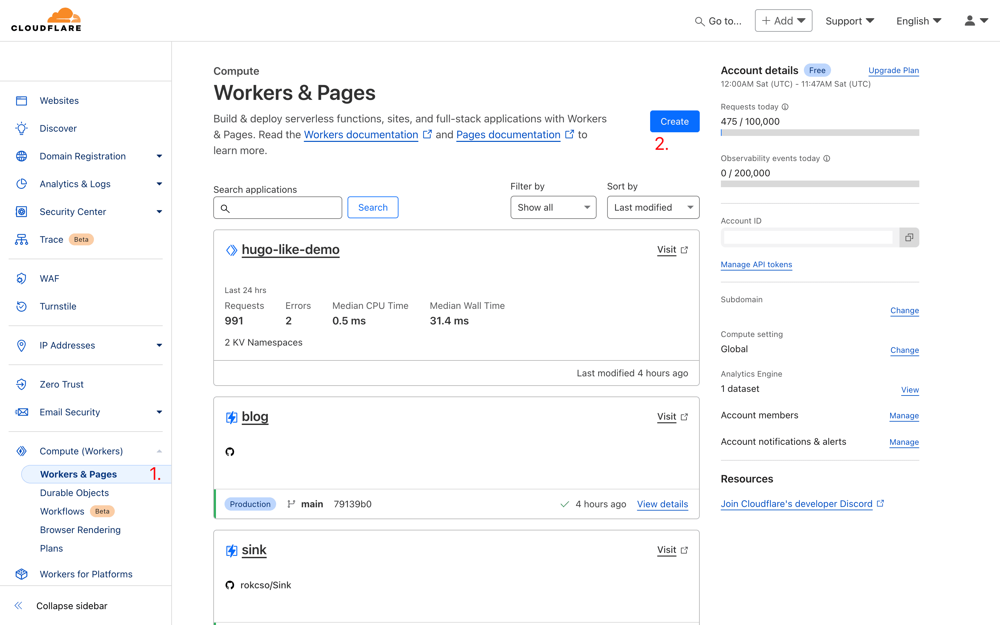
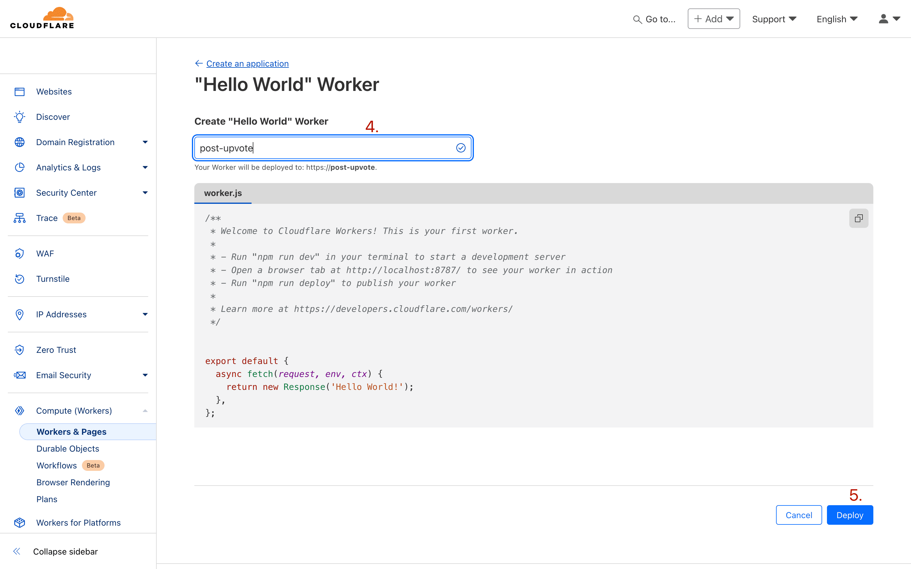
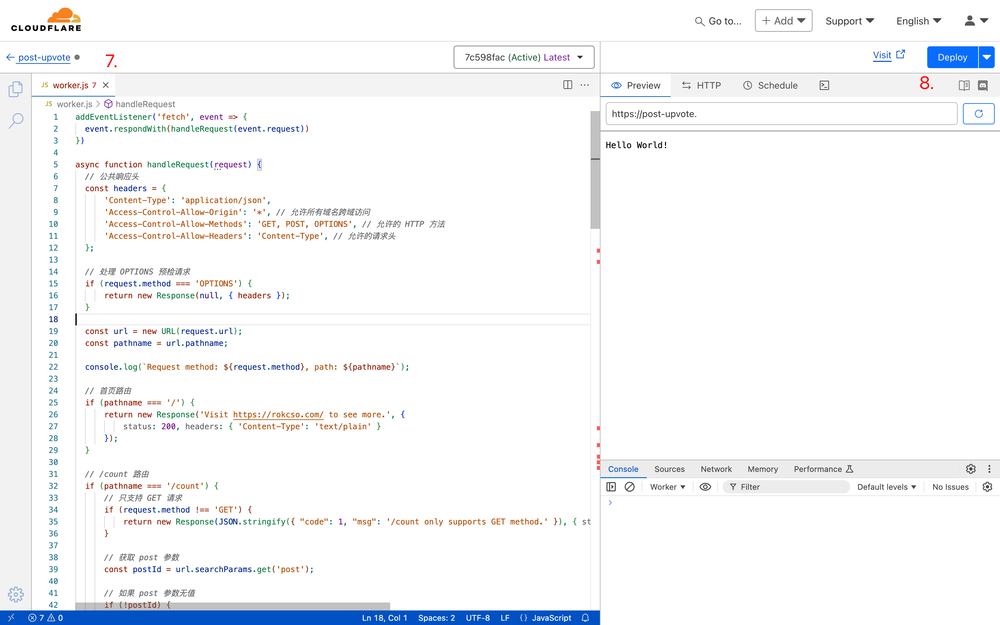
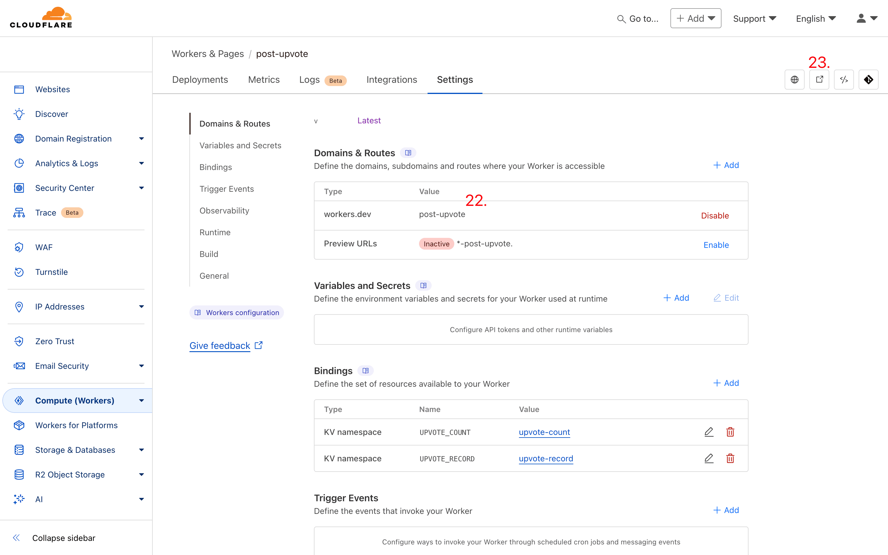
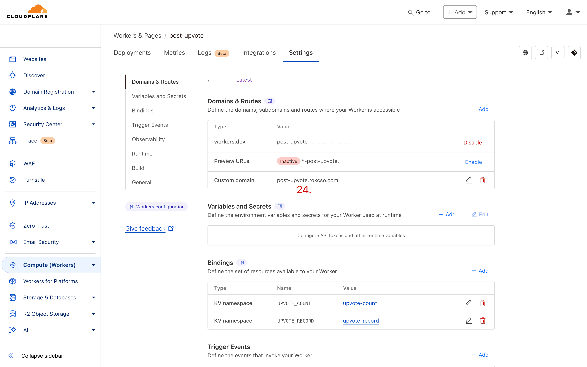

# Post Upvote API

[English](./README.md) | [简体中文](./doc/README_zh.md)

This project serves as the backend service for the Upvote feature in [hugo-bearblog-neo](https://github.com/rokcso/hugo-bearblog-neo). Built on Cloudflare Workers + KV, it allows for easy self-deployment.

> Upvote feature: Allows users to upvote individual articles, counts the number of upvotes for each article, and determines the upvote status of a user for a single article.

**TOC**

- [Deployment Guide](#deployment-guide)
  - [Deploy Worker](#deploy-worker)
  - [Create KV namespace](#create-kv-namespace)
  - [Bind KV namespace to Worker](#bind-kv-namespace-to-worker)
  - [Testing](#testing)
  - [Tips](#tips)
- [How to enable the Upvote feature in hugo-bearblog-neo?](#how-to-enable-the-upvote-feature-in-hugo-bearblog-neo)
- [Acknowledgments](#acknowledgments)

## Deployment Guide

### Deploy Worker

Register/Log in to the Cloudflare dashboard, navigate to the Workers module, and click on Create (as shown in the figure at point 2).

Click Create Worker (point 3).

Enter any name (e.g., post-upvote) and then click Deploy (point 5).

Then click on Edit code (point 6).

Delete the existing code in the code editor (point 7), then copy and paste the code from the [worker.js](https://github.com/rokcso/post-upvote-api/blob/main/worker.js) file of this project into the code editor, and click Deploy (point 8).

### Create KV namespace

Register/Log in to the Cloudflare dashboard, navigate to the KV module, and click on Create (point 10).

Enter any name (e.g., upvote-count) and then click Add (point 12).

Create another KV namespace using the same steps, and you can still name it whatever you like (e.g., upvote-record).

### Bind KV namespace to Worker

Register/Log in to the Cloudflare dashboard, navigate to the Workers module, and then click to enter the Worker you just created (As in the case of post-upvote in this example, point 14).

Go to Settings -> Bindings in the Worker, and click Add (point 17).

After selecting the KV namespace, enter the Variable name as `UPVOTE_COUNT`, then choose a newly created KV namespace (e.g., upvote-count), and click Save (point 20).

Create another Variable named `UPVOTE_RECORD` using the same steps, and select the another newly created KV namespace (e.g., upvote-record), and then click Save.

The correct configuration should be as shown in the figure at point 21, where the Variable names (namely `UPVOTE_COUNT` and `UPVOTE_RECORD`) must not be incorrect.

### Testing

Register/Log in to the Cloudflare dashboard, navigate to the Workers module, and click on the Worker you just created. Go to Settings -> Domains & Routes within that Worker. The Value corresponding to the default enabled workers.dev domain (point 22) is the domain for this Worker.

Or simply click as shown in the figure at point 23 to access the Worker's domain.

If you can see the prompt as shown in the figure below after accessing the Worker's domain through a browser, it means the deployment was successful.

### Tips

Access to the workers.dev domain of Cloudflare Workers may not be smooth within China, and this issue can be resolved by adding a custom domain for the Worker.

## How to enable the Upvote feature in hugo-bearblog-neo?

For details, refer to the [user guide](https://github.com/rokcso/hugo-bearblog-neo/) provided by hugo-bearblog-neo.

## Acknowledgments

Thanks to [bearblog](https://github.com/HermanMartinus/bearblog) for creating Bear Blog, and thanks to [hugo-bearblog](https://github.com/janraasch/hugo-bearblog) for bringing Bear Blog to [Hugo](https://gohugo.io/).

Thanks to [Emaction](https://github.com/emaction/emaction.backend) and [hugo-cf-worker](https://github.com/bigfa/hugo-cf-worker) for inspiring the implementation ideas of this project.

Thanks to [Cloudflare](https://www.cloudflare.com/) for providing all the features and resources that made this project possible.