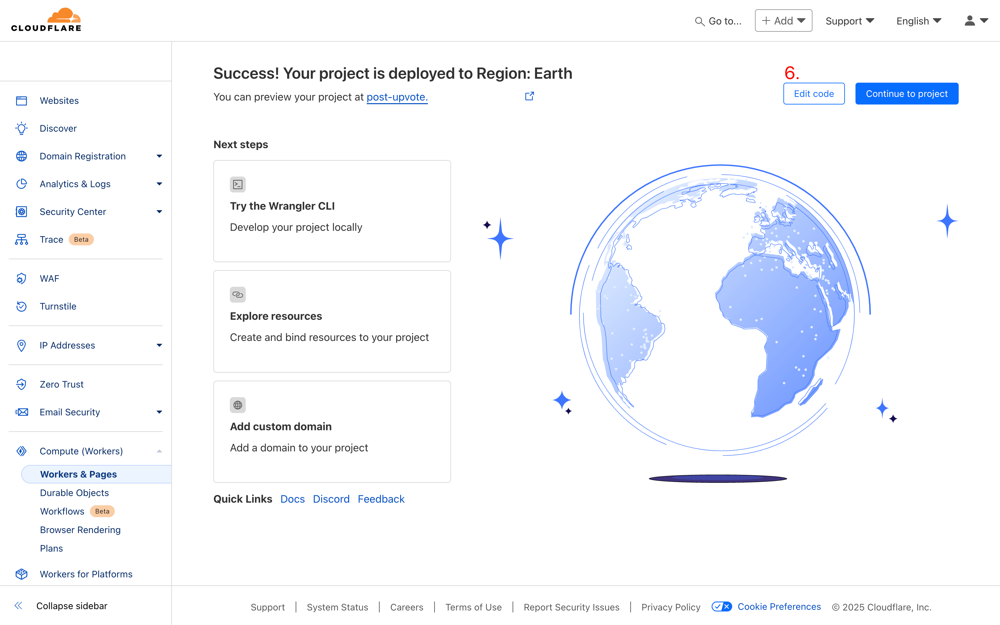

# post-upvote-api

[English](../README.md) | [简体中文](./README_zh.md)

本项目是 [hugo-bearblog-neo](https://github.com/rokcso/hugo-bearblog-neo) 中 Upvote 功能的后端服务。基于 Cloudflare Workers + KV，可以非常方便地自部署。

> Upvote 功能：支持用户对单篇文章进行 Upvote，统计每篇文章的 Upvote 数，判断用户对单篇文章的 Upvote 状态。

**TOC**

- [post-upvote-api](#post-upvote-api)
  - [部署指南](#部署指南)
    - [部署 Worker](#部署-worker)
    - [创建 KV namespace](#创建-kv-namespace)
    - [为 Worker 绑定 KV namespace](#为-worker-绑定-kv-namespace)
    - [测试](#测试)
    - [注意事项](#注意事项)
  - [如何在 hugo-bearblog-neo 中启用 Upvote 功能？](#如何在-hugo-bearblog-neo-中启用-upvote-功能)
  - [鸣谢](#鸣谢)

## 部署指南

### 部署 Worker

注册/登录 Cloudflare 后台，前往 Workers 模块后点击 Create（下图 2 处）。

点击 Create Worker（下图 3 处）。

随便输入一个名称（比如 post-upvote）后点击 Deploy（下图 5 处）。

然后点击 Edit code（下图 6 处）。

删除代码编辑器（下图 7 处）中原有的代码，将本项目 [worker.js](https://github.com/rokcso/post-upvote-api/blob/main/worker.js) 中的代码完全复制粘贴到代码编辑器中，点击 Deploy（下图 8 处）。

### 创建 KV namespace

注册/登录 Cloudflare 后台，前往 KV 模块后点击 Create（下图 10 处）。

随便输入一个名称（比如 upvote-count）后点击 Add（下图 12 处）。

用相同的步骤再创建一个 KV namespace，依然可以随便命名（比如 upvote-record）。

### 为 Worker 绑定 KV namespace

注册/登录 Cloudflare 后台，前往 Workers 模块后点击进入刚刚创建的 Worker（如本案例中下图 14 处的 post-upvote）。

前往该 Worker 中的 Settings -> Bindings，点击 Add（下图 17 处）。

选择 KV namespace 后输入 Variable name 为 `UPVOTE_COUNT`，然后选择一个刚刚创建的 KV namespace（比如 upvote-count），随后点击 Save（下图 20 处）。

用相同的步骤再创建一个 Variable name 为 `UPVOTE_RECORD`，选择刚刚创建的另一个 KV namespace（比如 upvote-record），随后点击 Save。

正确的配置应如下图 21 处，Variable name（即 `UPVOTE_COUNT` 和 `UPVOTE_RECORD`）一定不能错。

### 测试

注册/登录 Cloudflare 后台，前往 Workers 模块后点击进入刚刚创建的 Worker，进入该 Worker 中的 Settings -> Domains & Routes，此处默认启用的 workers.dev 域名后对应的 Value（下图 22 处）即为该 Worker 的域名。

或者直接点击下图 23 处访问该 Worker 的域名。

通过浏览器访问该 Worker 的域名后如果能看到如下图提示即为部署成功。

### 注意事项

中国境内可能无法顺畅访问 Cloudflare Workers 的 workers.dev 域名，可以通过为该 Worker 添加一个自定义域名解决。 

## 如何在 hugo-bearblog-neo 中启用 Upvote 功能？

详见 hugo-bearblog-neo 提供的 [使用指南](https://github.com/rokcso/hugo-bearblog-neo/)。

## 鸣谢

感谢 [bearblog](https://github.com/HermanMartinus/bearblog) 创造了 Bear Blog，感谢 [hugo-bearblog](https://github.com/janraasch/hugo-bearblog) 将 Bear Blog 带到了 [Hugo](https://gohugo.io/)。

感谢 [Emaction](https://github.com/emaction/emaction.backend)、[hugo-cf-worker](https://github.com/bigfa/hugo-cf-worker) 启发了本项目的实现思路。

感谢 [Cloudflare](https://www.cloudflare.com/) 提供了本项目得以实现的所有功能和资源。